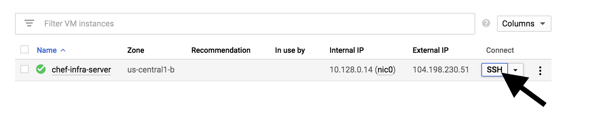
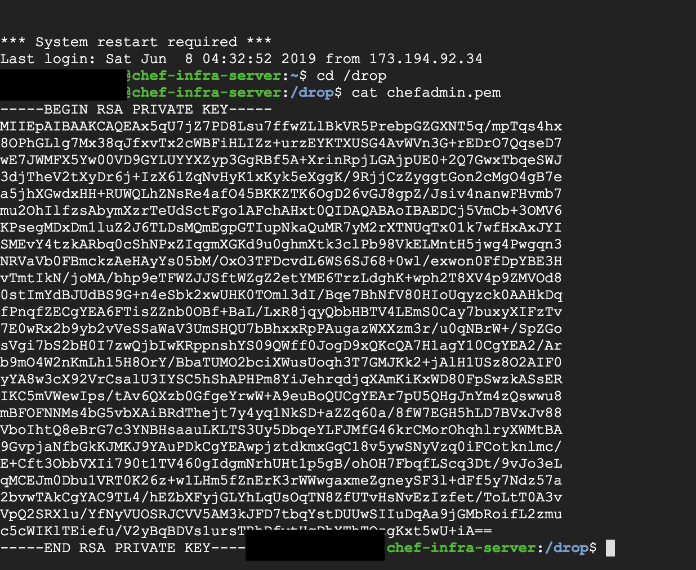

### Configuring your workstation to connect to the Chef Server


NB: It is assumed that all commands are executed while on the chef-cookbooks directory.
1. Export the `HOSTNAME` environment variable on your terminal. This variable was provided to your chef server instance in this [file](../chef-infrastructure/terraform.tfvars) under the name `hostname`. It refers to the domain that is pointing to our chef infrastructure server.

```
export HOSTNAME="The domain name that is pointing to your chef server"
```

2. Fetch the contents of the chefadmin.pem file on your server instance.

This step requires you to ssh into your running server. You can find more instructions [here](https://cloud.google.com/compute/docs/instances/connecting-to-instance).

Move into the /drop directory, and copy the contents of the chefadmin.pem

Copy the contents you find here to the chefadmin.pem file located under the .chef folder.
The contents fo the file change every time a new chef server instance is created.

3. Once this is done you can run the commands below to create a connection:

```
knife ssl fetch
```
The fetch command will fetch the certificate that was automatically generated to connect to your chef server using knife.

```
knife ssl check
```
The check command will confirm if the certificate that has been fetched is valid.

You should not get any errors with the commands above but success or warning messages.
If the commands work, your workstation is now connected to your chef infra server.


### Uploading a cookbook to the Chef Server

Once you have performed the [Configuring your workstation to connect to the Chef Server](#configuring-your-workstation-to-connect-to-the-Chef-Server) step you can upload a cookbook to your chef server.

1. Ensure that you are on the cookbooks directory before running the command below.

```
knife cookbook upload logogram-os
```
You should get the success message: *Created logogram-os*

### Testing a cookbook

To test a cookbook, you need to change directory into the cookbook and run the test command as shown below:

```
cd logogram-os
chef exec rspec
```

### Bootstrap the nodes with the cookbooks

The next step involves bootstrapping our nodes with the cookbooks that we just created. 

To bootstrap the **logogram-instance-node** run the command below:

```
knife bootstrap <ip address of the logogram node> --ssh-user ubuntu --sudo --identity-file chef_node_ssh_key --node-name node1-ubuntu --run-list 'recipe[logogram-os]'
```