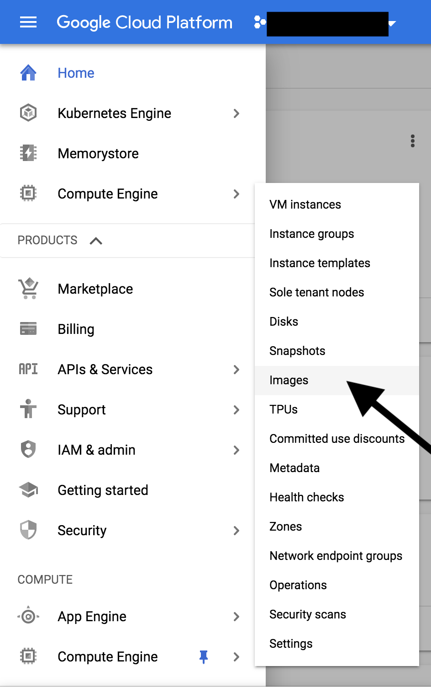

## Building the Logogram Base Image

1. Ensure that:
- You have a [Google Cloud Platform](https://console.cloud.google.com) account.
- That you have created or own a Google Cloud project to create the base image on.
- That the Compute Engine API has been enabled.
- That you have installed the packer package as per directions from this [link](https://www.packer.io/downloads.html) on your machine and that it is executable on your terminal.

2. Clone the Repository

```
git clone https://github.com/WinstonKamau/logogram.git
cd devops/logogram-base-image
```

3. Setup the service account

You may follow instructions on creating a service account as per this [link](https://cloud.google.com/iam/docs/creating-managing-service-accounts). The most critical part of the service account is the role that the account will be able to perform. Ensure that the service account has at lease admin capabilities of **Compute Image User**, **Compute Instance Admin** and **Service Account Actor**. Download the Service Account JSON key to your machine after giving the Service Account its roles.

Once you have gotten the key, change the name of the file [account.json.example](account-folder/account.json.example) to account.json. *This file is located under the account-folder directory*. Delete the contents in the file and paste your JSON key here.

4. Setup environment variables.

Let's start by changing the name of the [variables.json.example](./variables.json.example) file to variables.json.

Next, provide values for each of the keys shown in the table below. A description of the value needed has been given:

| **Key**           | **Value Description**|
|-------------------|----------------------|
| project_id        | Provide the google project id where you are hosting your application on|


4. Validate and build the base image.

```
packer validate --var-file variables.json packer.json
packer build --var-file variables.json packer.json
```

5. Visit GCP console to confirm that your image has been created.

On the menu page under Compute Engine click on Images.

You should be able to see the image logogram-base-image on the list of images.
