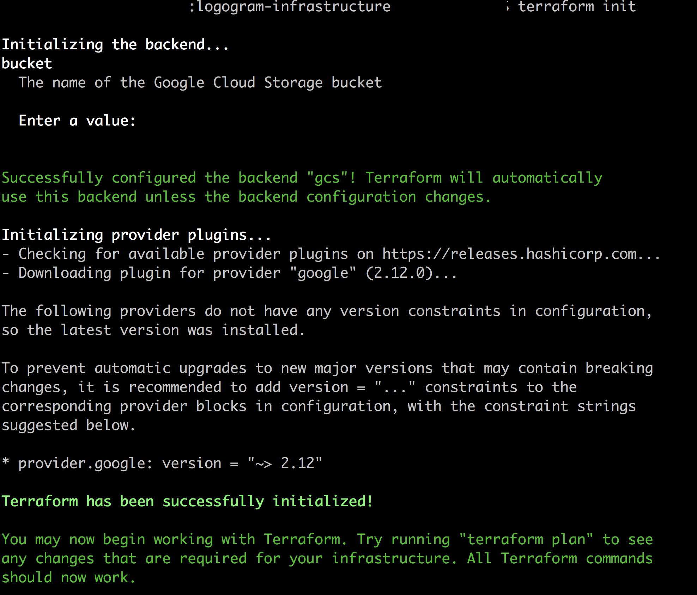
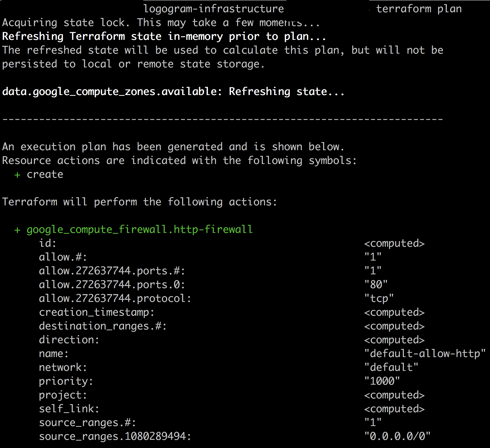
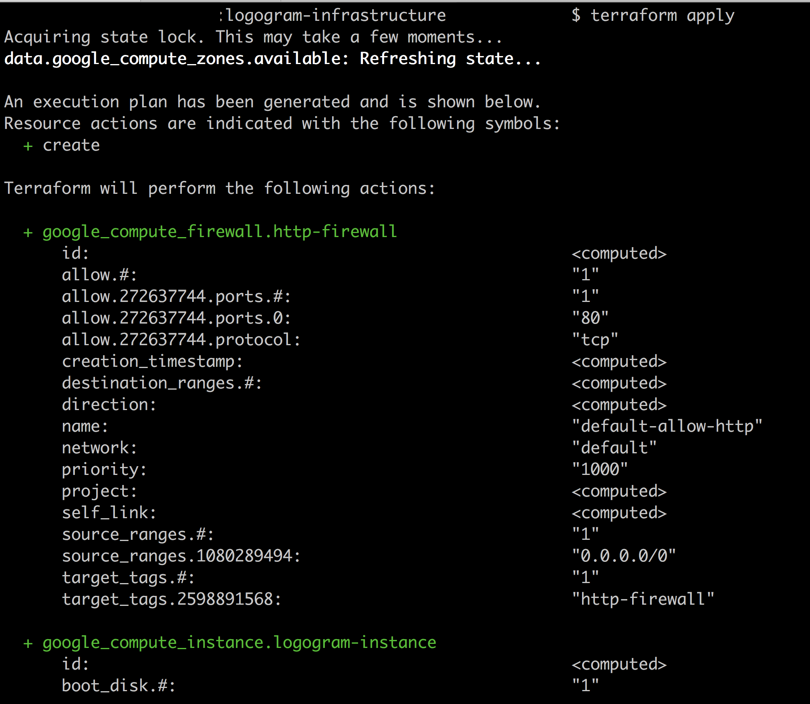

### Running Terraform scripts

1. Pass environment variables

Our deployment script requires some environment variables. Create a file called terraform.tfvars on the root of your repository. You can derive the structure of secrets needed using the [terrafrom.tfvars.example](terraform.tfvars.example) file on the root of your repository. Replace each of the secret with its respective value.


2. Initializing terraform. 
First step involves initializing terraform. To perform this step you need to have the name of your storage bucket that you created the Packer Base Image.

Run the command below on the root of your repository:
```
terraform init
```



You should get a response like the one below. I have blocked the name of my storage bucket in the image below.


3. Create a plan.
The second step involves creating a terraform plan. This produces an output on the console indicating the plan that terraform will execute.
Run the command below on the root of your repository:
```
terraform plan
```



4. Create the infrastructure.

If you are comfortable with the plan shown in the step above, then create the infrastructure needed for the application by running the command below.

```
terraform apply
```



After running the command above you can visit your infrastructure and check whether your VM instance has been created.

**Note**
- If you have an issue with running the `terraform init` command when setting up the environment variables, sometimes deleting the .terraform folder that is created locally on the folder where you ran the command, will help.

